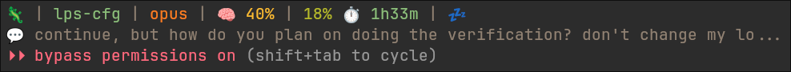

# lps-statusline

[](LICENSE)
[](#compatibility)
[](#requirements)
[](https://github.com/anthropics/claude-code)

A custom status line for Claude Code showing real-time usage quota, reasoning effort level, git integration, accurate context window, and more — powered entirely by the data Claude Code already provides. No cookies, no Python, no network requests.



*(screenshot from an earlier version — the current version also shows the effort level and drops the iguana)*

## Features

- **Model indicator** — Current model + version (fable5/opus4.8/sonnet5/haiku4.5) with color coding
- **Effort level** — Current reasoning effort (`low`/`medium`/`high`/`xhigh`/`max`), color-coded by tier
- **Fast mode** — ⚡ appears when fast mode is active
- **Git integration** — Repository name, branch, and changed file count
- **Context window** — Percentage of context used with color gradient
- **Usage quota** — 5-hour and 7-day limits straight from Claude Code's native data
- **Reset timer** — Time remaining until quota resets
- **Pace indicator** — Visual feedback on consumption rate
- **Second line** — Shows your last message for context (experimental)
- **Gruvbox theme** — Warm, easy-on-the-eyes color palette

## Quick Install

**One-liner:**
```bash
curl -sSL https://raw.githubusercontent.com/lpsgverrilla/lps-statusline/main/install-remote.sh | bash
```

**Or clone manually:**
```bash
git clone https://github.com/lpsgverrilla/lps-statusline.git
cd lps-statusline
./install.sh
```

The installer copies `statusline.sh` to `~/.local/share/lps-statusline/` and configures Claude Code (or shows manual steps if you decline). Then restart Claude Code. Done!

### Status Line Layout

```
project-name | repo(main) | ✓ 0 | fable5(xhigh) | 🧠 15% | 31% ⏱️ 2h40m | 🟢
💬 Your last message appears here...
```

### Status Indicators

| Element | Description |
|---------|-------------|
| project-name | Working directory name. **Aqua** if the directory contains `CLAUDE.md` or `.claude/` (a Claude project), **dim red** otherwise |
| repo(main) | Git repository name and current branch. Only shown when inside a git repository |
| ✓ 0 | Git status: **✓** (green) = clean working tree, **△** (yellow) = 1-5 changed files, **●** (red) = 6+ changed files |
| fable5 | Current model + version: **purple** = fable/mythos, **orange** = opus, **blue** = sonnet, **aqua** = haiku |
| (xhigh) | Reasoning effort level, color-coded: low = gray, medium = aqua, high = yellow, xhigh = orange, max = red. Omitted for models without effort support |
| ⚡ | Fast mode is active (only shown when on) |
| 🧠 15% | Context window usage — how much of the model's context limit is currently in use. Shows `~N%` (with tilde) only when it must be estimated |
| 31% ⏱️ 2h40m | 5-hour usage quota percentage and time until reset |
| 🟢 | Pace indicator (see below) |

### Conditional Indicators

The statusline follows a **minimalist philosophy** — additional indicators only appear when they require attention:

| Element | When Shown | Description |
|---------|------------|-------------|
| 7d:N% | When > 65% | 7-day rolling usage quota (weekly limit) |
| 🚨🚨🚨 | Opt-in, when a window hits 100% | Extra-usage warning — disabled by default, see [Configuration](#configuration) |

### Line 2: Last Message

The second line shows your most recent message for context:

```
💬 Your last message appears here...
```

> **Note:** This feature is experimental. The implementation is adapted from [claude-code-tips](https://github.com/ykdojo/claude-code-tips) by ykdojo and parses the transcript file directly. It may not work correctly in all situations — messages might be stale, missing, or incorrectly extracted. Consider it a "best effort" feature.

### Pace Indicator Reference

| Emoji | Meaning |
|-------|---------|
| 💤 | Very low usage (< 50% of expected) |
| 🔵 | Below average (50-90%) |
| 🟢 | On track (90-105%) |
| 🟡 | Slightly fast (105-120%) |
| 🟠 | Fast (120-140%) |
| 🔴 | Very fast (140-170%) |
| 🔥 | Burning through quota (> 170%) |

## How It Works

Claude Code invokes `statusline.sh` and passes a JSON payload on stdin containing the model, effort level, context window stats, rate limits, and workspace info. The script parses it (a single `jq` call), adds git status, and prints the formatted line. That's the whole pipeline:

```
Claude Code → statusline.sh → Terminal output
```

Everything is read from that JSON — the script makes **no network requests** and reads **no credentials**.

## Compatibility

### Operating Systems

| OS | Status | Notes |
|----|--------|-------|
| **Linux** | ✅ Full support | Any distro (Arch, Ubuntu, Fedora, etc.) |
| **macOS** | ✅ Supported | Requires bash 4+ (install via Homebrew: `brew install bash`) |
| **Windows (WSL)** | ✅ Supported | Use WSL2 with any Linux distro |
| **Windows (native)** | ❌ Not supported | Scripts require bash |

### Terminals

Any terminal with **24-bit true color** support:
- Kitty, Alacritty, iTerm2, Windows Terminal, WezTerm
- GNOME Terminal, Konsole, Tilix (most modern terminals)
- VS Code integrated terminal

### Requirements

- **bash** 4.0+
- **jq** — JSON processor
- **git** — For repository info
- **Claude Code** ≥ 2.1.214 for the quota and effort sections (older versions still work — those sections simply don't appear)

## Configuration

### Extra-usage warning (opt-in)

To show 🚨🚨🚨 when a usage window is exhausted (≥100%), either:

- set `SHOW_EXTRA_USAGE=1` at the top of `statusline.sh`, or
- export `LPS_STATUSLINE_EXTRA_USAGE=1` in the environment Claude Code runs in.

### Changing Colors

The statusline uses Gruvbox Dark theme by default. To customize, edit the color definitions at the top of `statusline.sh`.

## Tests

```bash
bash tests/render-test.sh
```

Feeds fixture JSON payloads (all model families, effort levels, quota states, malformed input) through the script and asserts on the rendered output.

## Troubleshooting

### Quota or effort section not appearing

Both come from fields Claude Code only sends in recent versions (≥ 2.1.214) — update Claude Code. The effort suffix is also omitted for models without effort support. If you use Claude Code with a raw API key instead of a subscription, there are no 5h/7d rate limits to display.

### Git section not appearing

The git section only shows when inside a git repository. Verify with:
```bash
git rev-parse --git-dir
```

Also ensure `git` is installed and in your PATH.

### Context shows ~N% (with tilde)

The `~` prefix indicates an estimate, used only at the very start of a conversation before Claude Code provides token counts. It resolves automatically after the first response.

### macOS: Statusline errors or wrong behavior

macOS ships with bash 3.2, but lps-statusline requires bash 4+. Ensure you're using Homebrew bash:
```bash
# Check Homebrew bash version
/opt/homebrew/bin/bash --version  # Apple Silicon
/usr/local/bin/bash --version     # Intel Mac
```

Your `~/.claude/settings.json` must use the full path to Homebrew bash in the command field.

### Claude Code Subagent

This project includes a **statusline-specialist** subagent for Claude Code. When installed, Claude Code can automatically spawn this specialist agent to help with statusline-related tasks: troubleshooting display issues, debugging data sources, modifying appearance, adding indicators, or fixing calculation errors.

During installation you choose which model the subagent uses (sonnet for speed, opus for complex debugging). The installer copies the agent definition to `~/.local/share/lps-statusline/.claude/agents/`; you can also copy it into any project's `.claude/agents/` folder.

## Credits

Created by [lps](https://github.com/lpsgverrilla).

### Inspiration

This project was inspired by and builds upon ideas from:

- **[ccstatusline](https://github.com/sirmalloc/ccstatusline)** by sirmalloc — A clean statusline implementation that showed what's possible with Claude Code's custom statusline feature.
- **[claude-code-tips](https://github.com/ykdojo/claude-code-tips)** by ykdojo — Great collection of Claude Code tips including statusline customization ideas. The "last message" second line feature is adapted from their transcript parsing approach.

If you're looking for alternatives or want to explore different approaches, check out their work!

### History

Earlier versions fetched usage data from the claude.ai API using browser session cookies (Python + browser_cookie3). Since Claude Code now provides rate-limit data natively in the statusline JSON, all of that machinery was removed in jul/2026 — along with the 🌹 Sonnet quota and the 💡 iguana easter egg. If you need the cookie-based version, it lives in the git history before the native-data rewrite.

## License & Disclaimer

**MIT License** — see [LICENSE](LICENSE)

### Disclaimer

This is an independent community project. It is **not affiliated with, endorsed by, or sponsored by Anthropic** in any way, shape or form. "Claude" and "Claude Code" are trademarks of Anthropic.

**Who can use this?**

The usage quota display is designed for **Claude Pro and Claude Max subscribers**, as these plans have the 5-hour and 7-day usage limits Claude Code reports. If you use Claude Code with an API key, the quota section won't appear.

**No warranty:**

This software is provided "as is", without warranty of any kind. Use at your own risk.

**Tested environment:**

This project was developed and tested on:
- **Claude Code**: 2.1.x
- **OS**: Arch Linux (kernel 7.x)
- **Terminal**: Kitty
- **Shell**: bash/zsh

It *should* work on other Claude Code versions, Linux distributions, macOS, and WSL, but your mileage may vary. Bug reports and contributions for other platforms are welcome, but no promises.
